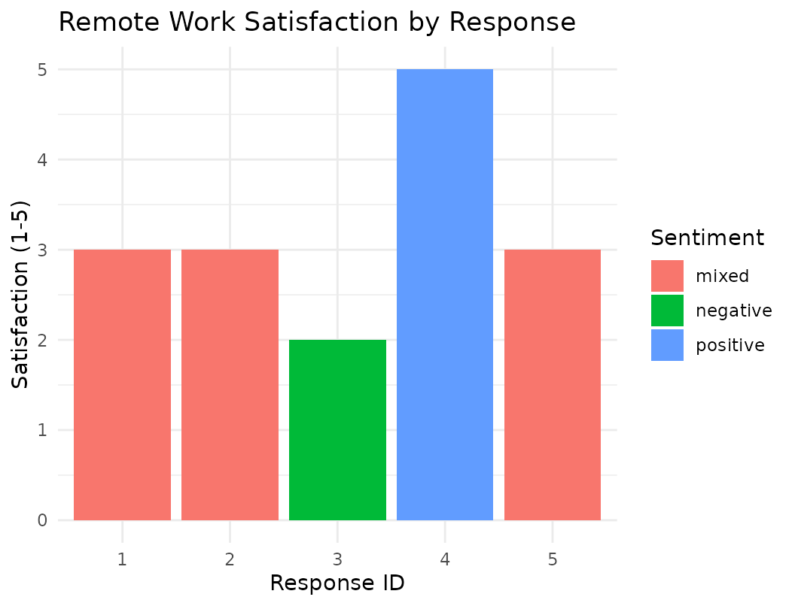

# 5. Field Specifications for Structured Extraction

## Introduction

When using
[`llm_extract()`](https://smin95.github.io/tidychat/reference/llm_extract.md),
you must define a schema using field specification functions. These
functions tell the LLM what information to extract and what type of
output to return. Each field specification includes a description that
guides the LLM, and for categorical fields, a list of allowed values.

``` r

knitr::kable(
  data.frame(
    Function = c("`field_category()`", "`field_integer()`", "`field_number()`", 
                 "`field_text()`", "`field_boolean()`", "`field_array()`"),
    Output_Type = c("Categorical", "Integer", "Numeric", 
                    "Free text", "TRUE/FALSE", "List/Array"),
    Use_Case = c(
      "Sentiment, design type, binary outcomes",
      "Ratings, counts, sample sizes",
      "Effect sizes, p-values, means",
      "Limitations, conclusions, open-ended responses",
      "Significance flags, preregistration indicators",
      "Multiple themes, outcomes, or limitations"
    )
  ),
  caption = "Field specification functions for structured extraction in `llm_extract()`",
  align = c("l", "l", "l"),
  format = "markdown"
)
```

| Function | Output_Type | Use_Case |
|:---|:---|:---|
| [`field_category()`](https://smin95.github.io/tidychat/reference/field_category.md) | Categorical | Sentiment, design type, binary outcomes |
| [`field_integer()`](https://smin95.github.io/tidychat/reference/field_integer.md) | Integer | Ratings, counts, sample sizes |
| [`field_number()`](https://smin95.github.io/tidychat/reference/field_number.md) | Numeric | Effect sizes, p-values, means |
| [`field_text()`](https://smin95.github.io/tidychat/reference/field_text.md) | Free text | Limitations, conclusions, open-ended responses |
| [`field_boolean()`](https://smin95.github.io/tidychat/reference/field_boolean.md) | TRUE/FALSE | Significance flags, preregistration indicators |
| [`field_array()`](https://smin95.github.io/tidychat/reference/field_array.md) | List/Array | Multiple themes, outcomes, or limitations |

Field specification functions for structured extraction in
[`llm_extract()`](https://smin95.github.io/tidychat/reference/llm_extract.md)
{.table}

## Setup

First, create a chat constructor using Ollama (free, runs locally):

``` r

library(tidychat)
library(dplyr)
library(tidyr)
library(ggplot2)

# Make sure Ollama is running locally
# Run: ollama pull llama3.2:3b

chat <- choose_ollama(model = "llama3", temperature = 0)
```

## Example 1: Extracting Therapy Session Information

Let’s extract structured information from therapy session notes using
multiple field types.

``` r

# Sample therapy notes
therapy_notes <- data.frame(
  session_id = 1:3,
  note = c(
    "Client reported significant reduction in anxiety symptoms after 8 weeks of CBT. 
     Reported using coping strategies daily. GAD-7 score dropped from 14 to 6.",
    
    "Client struggled with homework compliance this week. Only completed 2 of 5 
     assigned exercises. Reported feeling overwhelmed by work demands.",
    
    "Breakthrough session! Client identified core belief about worthlessness. 
     Emotional but productive. Completed all homework. PHQ-9 improved from 18 to 12."
  ),
  stringsAsFactors = FALSE
)

# Define extraction schema
therapy_fields <- list(
  # Categorical: overall session quality
  session_quality = field_category(
    description = "Overall quality/progress of the therapy session",
    categories = c("positive", "mixed", "negative")
  ),
  
  # Numeric: clinical scores
  anxiety_score = field_number(
    description = "GAD-7 score (0-21, higher = more anxiety), if reported",
    required = FALSE
  ),
  
  depression_score = field_number(
    description = "PHQ-9 score (0-27, higher = more depression), if reported",
    required = FALSE
  ),
  
  # Integer: homework completion
  homework_completed = field_integer(
    description = "Number of homework exercises completed (out of assigned total)"
  ),
  
  # Boolean: whether a breakthrough occurred
  breakthrough = field_boolean(
    description = "Whether the session involved a therapeutic breakthrough or insight"
  ),
  
  # Text: key themes
  key_themes = field_text(
    description = "Main themes or topics discussed (max 10 words)"
  )
)
```

``` r

# Extract
results <- therapy_notes %>%
  llm_extract(
    fields = therapy_fields,
    input = note,
    id = session_id,
    prompt_task = "Extract key clinical information from this therapy session note.",
    chat = chat,
    n_draws = 3,
    show_progress = TRUE
  )

# View results
head(results)
```

    #>   id
    #> 1  1
    #> 2  2
    #> 3  3
    #> 4  1
    #> 5  2
    #> 6  3
    #>                                                                                                                                                               note
    #> 1 Client reported significant reduction in anxiety symptoms after 8 weeks of CBT. \n     Reported using coping strategies daily. GAD-7 score dropped from 14 to 6.
    #> 2              Client struggled with homework compliance this week. Only completed 2 of 5 \n     assigned exercises. Reported feeling overwhelmed by work demands.
    #> 3  Breakthrough session! Client identified core belief about worthlessness. \n     Emotional but productive. Completed all homework. PHQ-9 improved from 18 to 12.
    #> 4 Client reported significant reduction in anxiety symptoms after 8 weeks of CBT. \n     Reported using coping strategies daily. GAD-7 score dropped from 14 to 6.
    #> 5              Client struggled with homework compliance this week. Only completed 2 of 5 \n     assigned exercises. Reported feeling overwhelmed by work demands.
    #> 6  Breakthrough session! Client identified core belief about worthlessness. \n     Emotional but productive. Completed all homework. PHQ-9 improved from 18 to 12.
    #>   draw_id model_name provider
    #> 1       1     llama3   ollama
    #> 2       1     llama3   ollama
    #> 3       1     llama3   ollama
    #> 4       2     llama3   ollama
    #> 5       2     llama3   ollama
    #> 6       2     llama3   ollama
    #>                                                             prompt params_hash
    #> 1 Extract key clinical information from this therapy session note.    f9adadf6
    #> 2 Extract key clinical information from this therapy session note.    f9adadf6
    #> 3 Extract key clinical information from this therapy session note.    f9adadf6
    #> 4 Extract key clinical information from this therapy session note.    f9adadf6
    #> 5 Extract key clinical information from this therapy session note.    f9adadf6
    #> 6 Extract key clinical information from this therapy session note.    f9adadf6
    #>            query_time session_quality anxiety_score depression_score
    #> 1 2026-05-29 09:09:13        positive             8                0
    #> 2 2026-05-29 09:09:13        positive             0             <NA>
    #> 3 2026-05-29 09:09:13        positive          <NA>               12
    #> 4 2026-05-29 09:10:01        positive             8                0
    #> 5 2026-05-29 09:10:01        positive             0             <NA>
    #> 6 2026-05-29 09:10:01        positive          <NA>               12
    #>   homework_completed breakthrough    key_themes temperature max_tokens
    #> 1                  1         TRUE       anxiety           0        500
    #> 2                  2        FALSE   overwhelmed           0        500
    #> 3                  1         TRUE worthlessness           0        500
    #> 4                  1         TRUE       anxiety           0        500
    #> 5                  2        FALSE   overwhelmed           0        500
    #> 6                  1         TRUE worthlessness           0        500

## Example 2: Systematic Review Data Extraction

This example demonstrates extracting multiple fields from research
abstracts for literature review.

``` r

abstracts <- data.frame(
  study_id = 1:3,
  abstract = c(
    "We randomized 120 participants (mean age 45.2, SD = 8.3) to either 
     mindfulness-based stress reduction (n=60) or waitlist control (n=60). 
     Primary outcome was anxiety (GAD-7). Results showed significant 
     improvement (d = 0.72, p < .001, 95% CI [0.45, 0.99]).",
    
    "This meta-analysis included 28 studies (total N = 3,247 participants) 
     examining the relationship between social media use and depression in 
     adolescents. Overall effect was small but significant (r = 0.18, 
     95% CI [0.12, 0.24], p < .001). Heterogeneity was moderate (I² = 45%).",
    
    "A longitudinal study followed 89 mother-child dyads (children aged 3-5 years) 
     for 2 years. No significant effects of authoritative parenting on emotion 
     regulation were found (β = 0.08, p = .32)."
  ),
  stringsAsFactors = FALSE
)
```

First, define what information you need to extract from each abstract.
The `field_*()` functions ensure consistent, typed output:

``` r

# Define fields for systematic review
review_fields <- list(
  # Numeric fields
  sample_size = field_number(
    description = "Total number of participants in the study"
  ),
  
  effect_size = field_number(
    description = "Effect size (Cohen's d, Hedges' g, or r), if reported",
    required = FALSE
  ),
  
  p_value = field_number(
    description = "P-value for the main finding (extract as decimal, e.g., 0.001)",
    required = FALSE
  ),
  
  # Categorical fields
  study_design = field_category(
    description = "Study design",
    categories = c("RCT", "meta-analysis", "longitudinal", "cross-sectional", "qualitative")
  ),
  
  significance = field_category(
    description = "Were the main findings statistically significant?",
    categories = c("yes", "no", "mixed", "not reported")
  ),
  
  population = field_category(
    description = "Population studied",
    categories = c("adults", "adolescents", "children", "older adults", "clinical", "community")
  ),
  
  # Boolean field
  heterogeneity_reported = field_boolean(
    description = "Does the study report heterogeneity statistics (I², Q, tau²)?",
    required = FALSE
  ),
  
  # Text field for additional notes
  notes = field_text(
    description = "Any notable methodological details (max 20 words)",
    required = FALSE
  )
)
```

Process the abstracts with `n_draws = 3` to measure extraction
reliability:

``` r

# Extract data
review_results <- abstracts %>%
  llm_extract(
    fields = review_fields,
    input = abstract,
    id = study_id,
    prompt_task = "Extract key study characteristics from this abstract for a systematic review.",
    chat = chat,
    n_draws = 3,
    show_progress = TRUE
  )

head(review_results)
```

Use[`summarise_draws()`](https://smin95.github.io/tidychat/reference/summarise_draws.md)
to check how consistently the LLM extracted each field across the 3
draws:

``` r

# Assess extraction reliability
reliability <- review_results %>%
  group_by(id) %>%
  summarise_draws(sample_size, study_design, significance, population)

print(reliability)
#> # A tibble: 12 × 9
#>    column          id n_draws n_valid majority      agreement entropy uncertain
#>    <chr>        <int>   <int>   <int> <chr>             <dbl>   <dbl> <lgl>    
#>  1 sample_size      1       3       3 120                   1       0 FALSE    
#>  2 sample_size      2       3       3 3247                  1       0 FALSE    
#>  3 sample_size      3       3       3 89                    1       0 FALSE    
#>  4 study_design     1       3       3 RCT                   1       0 FALSE    
#>  5 study_design     2       3       3 meta-analysis         1       0 FALSE    
#>  6 study_design     3       3       3 longitudinal          1       0 FALSE    
#>  7 significance     1       3       3 yes                   1       0 FALSE    
#>  8 significance     2       3       3 yes                   1       0 FALSE    
#>  9 significance     3       3       3 no                    1       0 FALSE    
#> 10 population       1       3       3 adults                1       0 FALSE    
#> 11 population       2       3       3 adolescents           1       0 FALSE    
#> 12 population       3       3       3 children              1       0 FALSE    
#> # ℹ 1 more variable: distribution <chr>
```

The output shows perfect reliability across all fields (agreement = 1,
entropy = 0). For `sample_size`, all 3 draws produced identical numbers
(120, 3247, and 89 respectively). For categorical fields like
`study_design` and `significance`, the distribution column confirms
complete consistency (e.g., “`RCT (3)`” indicates all 3 draws classified
the design as RCT). This high agreement indicates that for these clearly
written abstracts, the LLM’s extractions are trustworthy without manual
verification.

## Example 3: Qualitative Theme Extraction with Arrays

This example demonstrates how to use
[`field_array()`](https://smin95.github.io/tidychat/reference/field_array.md)
to extract multiple themes or features from open-ended survey responses.
Unlike scalar fields that return a single value, array fields return a
list column where each cell contains multiple items (e.g., all strengths
mentioned in a response).

``` r

# Open-ended survey responses
feedback_data <- data.frame(
  respondent_id = 1:3,
  feedback = c(
    "The app helped me track my mood daily. The graphs were insightful and 
     the reminders kept me accountable. However, the interface felt cluttered 
     and navigation was confusing at times. Customer support was responsive.",
    
    "Loved the breathing exercises! Very relaxing. The educational content 
     was clear and evidence-based. The community forum was supportive. 
     Wish there were more customization options and offline access.",
    
    "Found the CBT techniques very practical. The weekly progress reports 
     were motivating. The app crashed frequently which was frustrating. 
     The onboarding process was too long."
  ),
  stringsAsFactors = FALSE
)

# Define fields with arrays
qualitative_fields <- list(
  # Arrays for multiple themes
  strengths = field_array(
    description = "List of strengths or positive features mentioned",
    item_type = field_text("A single strength or positive feature")
  ),
  
  weaknesses = field_array(
    description = "List of weaknesses or areas for improvement mentioned, separated by commas",
    item_type = field_text("A single weakness or negative feature")
  ),
  
  features_mentioned = field_array(
    description = "List of specific features mentioned by name, separated by commas",
    item_type = field_text("Name of a feature mentioned")
  ),
  
  # Numeric summary
  strength_count = field_number(
    description = "Number of strengths mentioned"
  ),
  
  weakness_count = field_number(
    description = "Number of weaknesses mentioned"
  ),
  
  # Categorical overall sentiment
  overall_sentiment = field_category(
    description = "Overall sentiment of the feedback",
    categories = c("positive", "mixed", "negative")
  ),
  
  # Text field for key quote
  representative_quote = field_text(
    description = "Extract a representative quote from the feedback (max 15 words). Copy exactly.",
    required = TRUE
  )
)
```

``` r

# Extract qualitative data
qualitative_results <- feedback_data %>%
  llm_extract(
    fields = qualitative_fields,
    input = feedback,
    id = respondent_id,
    prompt_task = "Analyze this user feedback and extract key information.",
    chat = chat,
    n_draws = 2,
    show_progress = TRUE
  )

head(qualitative_results)
```

The resulting qualitative_results data frame has a special structure.
Looking at `str(qualitative_results)`, notice that the array fields
(`strengths`, `weaknesses`, `features_mentioned`) are list columns:

``` r

str(qualitative_results$strengths)
#> List of 6
#>  $ : chr [1:4] "helped track mood" "insightful graphs" "reminders kept me accountable" "responsive customer support"
#>  $ : chr [1:3] "breathing exercises" "educational content" "community forum"
#>  $ : chr [1:2] "practical CBT techniques" "weekly progress reports were motivating"
#>  $ : chr [1:4] "helped track mood" "insightful graphs" "reminders kept me accountable" "responsive customer support"
#>  $ : chr [1:3] "breathing exercises" "educational content" "community forum"
#>  $ : chr [1:2] "practical CBT techniques" "weekly progress reports were motivating"
```

Each row in the data frame corresponds to one draw (with `n_draws` = 2,
we have 2 rows per respondent). The `strengths` column contains a list
where each element is a character vector of multiple strengths. For
example, respondent 1’s first draw reported 4 distinct strengths, while
respondent 2 reported 3 strengths.

For certain analyses like counting frequency or creating bar charts, you
may want to unnest the list columns into long format (one row per
individual theme):

``` r

# Unnest arrays to see individual themes
strengths_long <- qualitative_results %>%
  select(id, draw_id, strengths) %>%
  tidyr::unnest(strengths, keep_empty = TRUE)

print(strengths_long)
#> # A tibble: 18 × 3
#>       id draw_id strengths                              
#>    <int>   <int> <chr>                                  
#>  1     1       1 helped track mood                      
#>  2     1       1 insightful graphs                      
#>  3     1       1 reminders kept me accountable          
#>  4     1       1 responsive customer support            
#>  5     2       1 breathing exercises                    
#>  6     2       1 educational content                    
#>  7     2       1 community forum                        
#>  8     3       1 practical CBT techniques               
#>  9     3       1 weekly progress reports were motivating
#> 10     1       2 helped track mood                      
#> 11     1       2 insightful graphs                      
#> 12     1       2 reminders kept me accountable          
#> 13     1       2 responsive customer support            
#> 14     2       2 breathing exercises                    
#> 15     2       2 educational content                    
#> 16     2       2 community forum                        
#> 17     3       2 practical CBT techniques               
#> 18     3       2 weekly progress reports were motivating
```

The [`unnest()`](https://tidyr.tidyverse.org/reference/unnest.html)
operation expands each list column so that each individual strength gets
its own row. Notice how `strengths_long` has 18 rows (compared to 6 rows
in the original data) because the 6 original rows contained a total of
18 individual strength items. The `id` and `draw_id` columns are
repeated to maintain the link back to the original response.

Similarly, we can unnest the `weaknesses`:

``` r

# Check consistency of theme counts across draws
weaknesses_long <- qualitative_results %>%
  select(id, draw_id, weaknesses) %>%
  tidyr::unnest(weaknesses, keep_empty = TRUE)

print(weaknesses_long)
#> # A tibble: 12 × 3
#>       id draw_id weaknesses                     
#>    <int>   <int> <chr>                          
#>  1     1       1 cluttered interface            
#>  2     1       1 confusing navigation           
#>  3     2       1 customization options          
#>  4     2       1 offline access                 
#>  5     3       1 app crashed frequently         
#>  6     3       1 onboarding process was too long
#>  7     1       2 cluttered interface            
#>  8     1       2 confusing navigation           
#>  9     2       2 customization options          
#> 10     2       2 offline access                 
#> 11     3       2 app crashed frequently         
#> 12     3       2 onboarding process was too long
```

### Important Note on Array Fields

When using cloud providers (Gemini, OpenAI, Anthropic),
[`field_array()`](https://smin95.github.io/tidychat/reference/field_array.md)
returns proper R list columns directly. When using Ollama,
[`llm_extract()`](https://smin95.github.io/tidychat/reference/llm_extract.md)
automatically parses the comma-separated responses into list columns as
well. This means **you never need to manually parse the output** - just
use [`unnest()`](https://tidyr.tidyverse.org/reference/unnest.html) to
expand the lists.

## Example 4: Open-ended survey responses

This example extracts structured data from open-ended survey responses
about remote working experiences during COVID-19. Specifically, this
example demonstrates how to analyze open-ended survey responses by
extracting both categorical judgments and quantitative ratings.

``` r

responses <- data.frame(
  response_id = 1:5,
  response_text = c(
    "Working from home has been great for my focus and productivity. 
     I have so much more freedom to manage my own schedule. 
     However, I'm in back-to-back Zoom meetings all day and barely 
     have time to eat lunch. The lack of casual interaction with 
     colleagues is really getting to me.",
    
    "I love the flexibility of remote work. No commute means I can 
     sleep longer and be with my family. But I feel disconnected 
     from my team and miss the spontaneous brainstorming. 
     Too many meetings, not enough actual work.",
    
    "Honestly, I'm burned out. My work-life balance is terrible now. 
     The boundaries between home and office are completely gone. 
     I'm expected to be available 24/7. The freedom is nice but 
     the isolation is crushing.",
    
    "Remote work saved my mental health. I can focus without 
     office distractions. My productivity is up 40%. I hope we 
     never go back to the office. The only downside is my team 
     communicates less informally now.",
    
    "Mixed feelings. I appreciate the flexibility and not commuting, 
     but I miss seeing coworkers face-to-face. Some days I'm 
     super productive, other days I feel completely alone. 
     The constant video calls are exhausting."
  ),
  stringsAsFactors = FALSE
)
```

The goal is to quantify sentiment, identify primary concerns, flag
specific issues, and obtain satisfaction ratings—all from free-text
responses.

Notice how we mix different field types to capture various aspects of
each response. Setting `required = TRUE` prevents missing values
(`NA`s), ensuring we have complete data for analysis.

``` r

coding_fields <- list(
  
  sentiment = field_category(
    description = "Overall sentiment toward remote work experience",
    categories = c("positive", "negative", "mixed", "neutral"),
    required = TRUE  # ← prevents NAs if TRUE
  ),
  
  primary_theme = field_category(
    description = "Primary theme or concern mentioned",
    categories = c(
      "flexibility/freedom",
      "productivity/focus",
      "isolation/loneliness",
      "too many meetings",
      "work-life balance",
      "commute benefits",
      "communication issues",
      "burnout/stress"
    ),
    required = TRUE  
  ),
  
  mentions_freedom = field_boolean(
    description = "Does the response mention freedom, flexibility, or schedule control? Answer TRUE or FALSE.",
    required = TRUE 
  ),
  
  satisfaction = field_number(
    description = "Overall satisfaction with remote work on a scale of 1-5 (1 = very dissatisfied, 5 = very satisfied). Answer with number 1-5.",
    required = TRUE  
  ),
  
  key_quote = field_text(
    description = "A representative quote from the response (max 20 words). If no good quote exists, use 'None'.",
    required = TRUE 
  )
)
```

``` r

# Extract data
response_results <- responses %>%
  llm_extract(
    fields = coding_fields,
    input = response_text,
    id = response_id,
    prompt_task = "Analyze this survey response about remote work during COVID-19. 
                   Extract sentiment, primary themes, flag specific issues 
                   (freedom, meetings, isolation, burnout), rate satisfaction 1-5,
                   and capture key quotes or suggestions.",
    chat = chat,
    n_draws = 3,  # 3 draws for reliability
    show_progress = TRUE
  )

head(response_results)
```

The resulting data frame has a familiar structure: each row represents
one draw (3 draws × 5 responses = 15 rows). Notice how all fields are
populated with values—no NAs—because we set `required = TRUE`:

``` r

str(response_results$satisfaction)
#>  chr [1:15] "3" "3" "2" "5" "3" "3" "3" "2" "5" "3" "3" "3" "2" "5" "3"
str(response_results$mentions_freedom)
#>  chr [1:15] "TRUE" "TRUE" "TRUE" "TRUE" "TRUE" "TRUE" "TRUE" "TRUE" "TRUE" ...
```

### Analyzing the Results

Now we can perform quantitative analysis on these extracted measures:

``` r

response_results %>% group_by(id) %>% summarise_draws(sentiment)
#> # A tibble: 5 × 9
#>   column    id n_draws n_valid majority agreement entropy uncertain distribution
#>   <chr>  <int>   <int>   <int> <chr>        <dbl>   <dbl> <lgl>     <chr>       
#> 1 senti…     1       3       3 mixed            1       0 FALSE     mixed (3)   
#> 2 senti…     2       3       3 mixed            1       0 FALSE     mixed (3)   
#> 3 senti…     3       3       3 negative         1       0 FALSE     negative (3)
#> 4 senti…     4       3       3 positive         1       0 FALSE     positive (3)
#> 5 senti…     5       3       3 mixed            1       0 FALSE     mixed (3)
```

The agreement of `sentiment` response across draws is 100%.

### Visualizing the Results

The extracted numeric ratings allow us to create informative
visualizations. Again, we aggregate across draws first:

``` r

# Prepare data for plotting (one row per response)
plot_data <- response_results %>%
  group_by(id) %>%
  summarise(
    satisfaction = as.numeric(first(satisfaction)),
    sentiment = first(sentiment),
    primary_theme = first(primary_theme),
    .groups = "drop"
  )

# Satisfaction by response, colored by sentiment
ggplot(plot_data, aes(x = as.factor(id), y = satisfaction, fill = sentiment)) +
  geom_col() +
  labs(
    title = "Remote Work Satisfaction by Response",
    x = "Response ID",
    y = "Satisfaction (1-5)",
    fill = "Sentiment"
  ) +
  theme_minimal()
```



## Summary

Field specifications provide a type-safe way to define what information
[`llm_extract()`](https://smin95.github.io/tidychat/reference/llm_extract.md)
should extract from your text. By combining different field types, you
can create complex extraction schemas for diverse research tasks:

- [`field_category()`](https://smin95.github.io/tidychat/reference/field_category.md)
  – Use when you need the LLM to choose from a predefined list of
  options

- [`field_integer()`](https://smin95.github.io/tidychat/reference/field_integer.md)
  /
  [`field_number()`](https://smin95.github.io/tidychat/reference/field_number.md)
  – Use for numeric values like scores, counts, or effect sizes

- [`field_text()`](https://smin95.github.io/tidychat/reference/field_text.md)
  – Use for open-ended responses or qualitative data

- [`field_boolean()`](https://smin95.github.io/tidychat/reference/field_boolean.md)
  – Use for yes/no flags or binary classifications

- [`field_array()`](https://smin95.github.io/tidychat/reference/field_array.md)
  – Use when you need to extract multiple items of the same type (e.g.,
  multiple themes)
