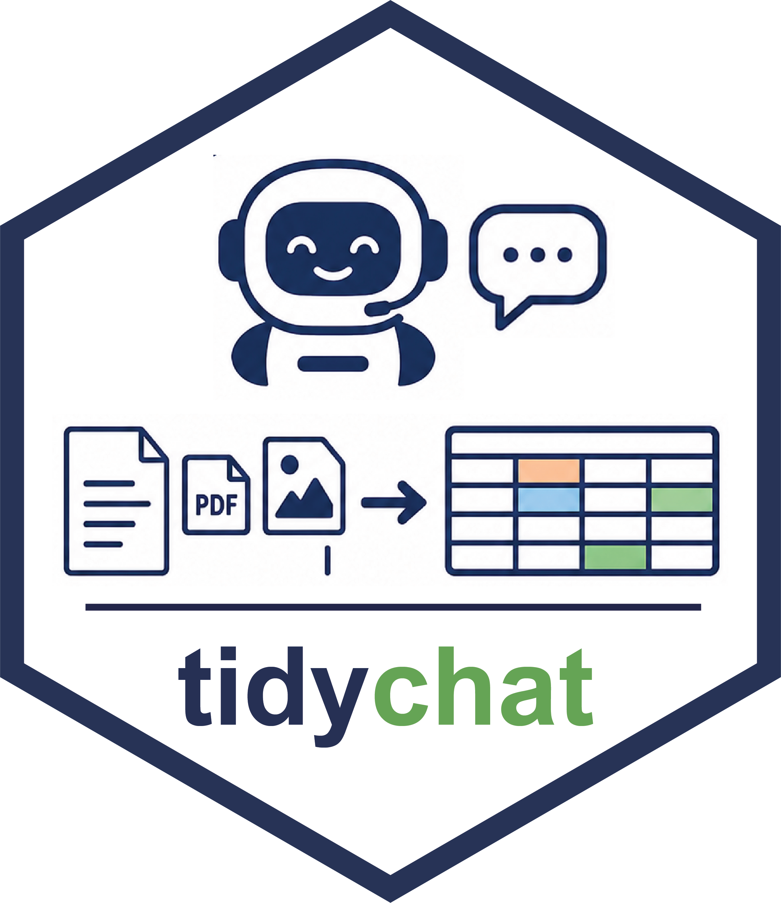

# **tidychat**: Tidy LLM Workflows for Text Annotation and Structured Extraction



[](https://github.com/smin95/tidychat)

**tidychat** is an R package designed for **interactive LLM-powered
annotation and structured data extraction**. It provides a unified
interface for working with multiple LLM providers including Ollama,
Gemini, OpenAI, Anthropic, Groq, DeepSeek, and Azure OpenAI.

### Why use tidychat for LLM Workflows?

- **Structured Data Extraction**: Extract categorized, numeric, or
  text-based fields from unstructured text, PDFs, images or others into
  a tidy data frame output.
- **Batch Annotation**: Annotate large text collections with flexible
  field definitions and progress tracking.
- **Automatic Metadata Tracking**: Every response automatically includes
  query timestamp, model name, provider, temperature, max_tokens, and
  exact prompt text in a tidy data frame output.
- **Multiple Draws & Uncertainty Quantification**: Take multiple
  independent responses per item and quantify agreement, entropy, and
  uncertainty with
  [`summarise_draws()`](https://smin95.github.io/tidychat/reference/summarise_draws.md).
- **Reproducible Workflows**: Define extraction schemas once and apply
  them consistently across datasets.

------------------------------------------------------------------------

### Documentation & Examples

For detailed guides on annotation workflows and provider configuration,
visit the official documentation: 👉 **[tidychat Documentation
Website](https://smin95.github.io/tidychat/)**

------------------------------------------------------------------------

### Installation using RStudio

Install the development version of **tidychat** from GitHub:

``` r

# Install remotes if not already installed
# install.packages("remotes")

remotes::install_github("smin95/tidychat")
```
